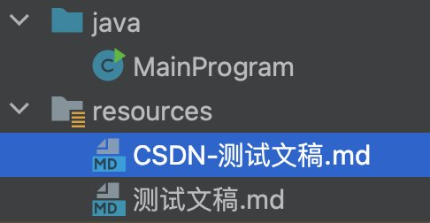

### CSDN MarkDown图片外链适配工具

---
### 解决问题：

MardDown 文档有 2 种格式的图片语法，即 ``与``，但是 CSDN 只支持第一种格式的语法，因此如果我们将第二种格式的图片插入到博客，则会如下图一样无法显示。所以我们必须要将第二种格式的图片语法转化成第一种格式。

---

### 使用说明：

将想要转换格式的 md 文档复制到项目的`/resources`目录，然后启动主程序，程序会自动生成文件名带有`CSDN-`标识的适配后文档。

